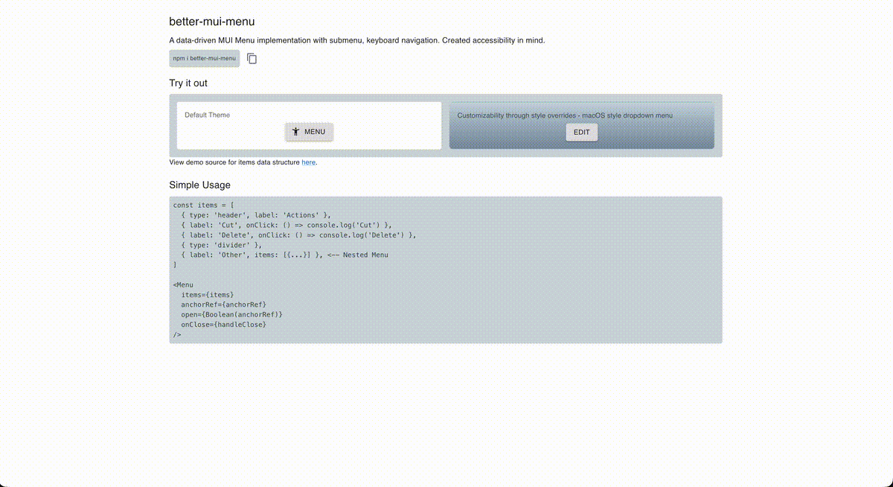

# better-mui-menu

[](https://github.com/eggei/better-mui-menu/actions/workflows/ci.yml) [](https://codecov.io/gh/eggei/better-mui-menu) [](https://www.npmjs.com/package/better-mui-menu) [](https://www.npmjs.com/package/better-mui-menu) [](https://opensource.org/licenses/MIT)

`better-mui-menu` is a lightweight drop-in for Material UI that keeps a normal `Menu` structure while adding nested menus and full keyboard accessibility so nothing breaks audits or expectations in an MUI app.

## Live demo

Try it:

[StackBlitz playground](https://stackblitz.com/edit/vitejs-vite-autejxh8?embed=1&file=src%2FMenuDemo.tsx&view=preview).

[](https://codesandbox.io/p/sandbox/9j2z7n)



## Features

- **Unlimited nesting** – describe every submenu with an `items` array and `better-mui-menu` renders `NestedMenuItem` poppers that stay synchronized with their parents.
- **Keyboard accessible** – arrow keys, Enter/Space, and Escape behave like desktop menus, while focus management and ARIA attributes make the tree readable by assistive tech.
- **Data-driven API** – you keep work in a single `MenuItem[]` list; leaves, dividers, and nested branches all live alongside each other.

## Installation

```bash
npm install better-mui-menu
```

Since the component renders Material UI primitives, also install the peer dependencies:

```bash
npm install @mui/material @emotion/react @emotion/styled @mui/icons-material
```

The `@mui/icons-material` peer is optional unless you use `startIcon`/`endIcon` helpers but we list it so consumers don’t need extra typings setup.

## Usage

```tsx
import { useState } from 'react'
import Button from '@mui/material/Button'
import Cloud from '@mui/icons-material/Cloud'
import Save from '@mui/icons-material/Save'
import { Menu, type MenuItem } from 'better-mui-menu'

const menuItems: MenuItem[] = [
  {
    id: 'save',
    label: 'Save',
    startIcon: Save,
    onClick: () => console.log('Save action'),
  },
  { type: 'divider' },
  {
    label: 'Cloud actions',
    startIcon: Cloud,
    items: [
      { label: 'Upload', onClick: () => console.log('Upload') },
      { label: 'Download', onClick: () => console.log('Download') },
    ],
  },
]

export function FileMenu() {
  const [anchorEl, setAnchorEl] = useState<null | HTMLElement>(null)

  return (
    <>
      <Button variant="contained" onClick={event => setAnchorEl(event.currentTarget)}>
        Open file menu
      </Button>
      <Menu
        anchorEl={anchorEl}
        open={Boolean(anchorEl)}
        onClose={() => setAnchorEl(null)}
        items={menuItems}
      />
    </>
  )
}
```

## Items shape

`MenuItem` extends `@mui/material/MenuItemProps` (excluding `children`) so you can still pass `dense`, `disabled`, `divider`, `aria-selected`, etc. The `better-mui-menu` shape adds:

- `type?: 'item' | 'divider'` – render a `Divider` when `'divider'` is supplied.
- `id?: string` – optional stable ID for ARIA attributes; one is generated automatically otherwise.
- `label: ReactNode` – the label shown in the menu row.
- `startIcon` / `endIcon` – pass any `SvgIconComponent` to display icons consistently with Material UI.
- `items?: MenuItem[]` – nested entries that render as submenus.
- `onClick?: MenuItemProps['onClick']` – leaves bubble clicks and close the menu stack so the consumer can handle the action.

## Accessibility & interactions

- Nested menus render in `Popper` instances positioned `right-start` from the trigger and fade in/out with a shared transition helper.
- Hover keeps a submenu open while the mouse moves between trigger and popper; leaving the area closes the branch.
- Keyboard navigation covers `ArrowUp`/`ArrowDown` through siblings, `ArrowRight` or `Enter/Space` to open children, `ArrowLeft` to back out, and `Escape` to dismiss every layer.
- ARIA helpers (`aria-haspopup`, `aria-controls`, `aria-expanded`, `aria-labelledby`) are wired automatically so assistive tech understands the structure.

## Development

The library lives inside `package/better-mui-menu`.

- `npm run dev` – rebuilds `src` into `dist` with `tsup --watch`.
- `npm run build` – creates production bundles ready for publication.
- `npm run test` – runs the Jest suite located at `src/**/*.test.{ts,tsx}`.
- `npm run test:coverage` – runs tests with coverage and writes reports to `coverage/`.

From the repository root you can use `npm run dev:lib` and `npm run dev:demo` together so the demo app consumes the rebuilt workspace link. Keep `npm run dev` (or `npm run build`) running before refreshing the demo because the Vite app imports the package via `file:`.
